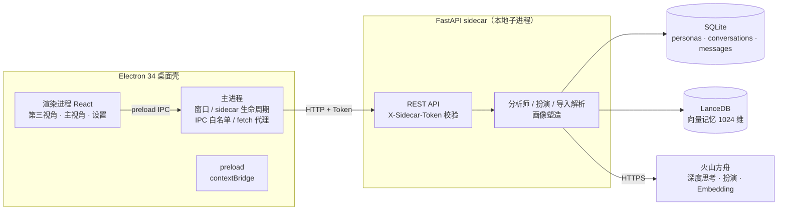

<div align="center">

# Emotional AI

**把「想说的话」，先说给 AI 听。**

一款纯本地的 AI 人格分析与对话预演桌面应用。
上传一段真实的聊天记录，让 AI 以第三方视角读懂「对方」，
再走进你的视角，替 TA 与你预演那场还没发生的对话。

`V1.0.0` · Windows · 纯本地运行

</div>

---

## 为什么做这件事

生活中最重要的那些对话——解释、道歉、争取、告别——往往发生在我们最没有准备的时候。
等真正坐到对方面前，情绪已经替我们说了话。

Emotional AI 想做的，是在对话发生之前，给你一个可以停下来思考的空间：

1. **先理解**——把你们的聊天记录交给「分析师」，从旁观者的角度读出 TA 的性格、在意的事与沟通模式；
2. **再预演**——由 AI 扮演 TA，和你反复推演想说的话，直到你说出自己想要的那一版；
3. **最后回到现实**——带着更清晰的判断，去进行那场真实的对话。

它不替你说话，只帮你看清。

## 核心功能

### 第三视角 · 分析师

- 粘贴 `名字：内容` 格式的聊天记录，或直接描述你所面对的情况；
- 深度思考模型流式解读：对方是什么样的人、雷区在哪里、建议你如何切入；
- 解读结果自动沉淀为**画像**（一句话概括 + 性格标签），随输入不断修正；
- 全程可见 AI 的工作状态（判断输入类型 → 整理对话记录 → 输出分析）。

### 主视角 · 对话预演

- AI 根据画像**扮演「对方」**，与你实时对话，可用模型一键切换；
- 每条回复附带分析师的**心路历程注解**，让你看到「TA 为什么这么说」；
- 历史聊天记录经向量化存入本地记忆库，对话时自动检索相关片段作为上下文，
  扮演越用越像。

### 画像与多关系管理

- 侧栏管理多个人物画像（家人、朋友、同事……彼此独立）；
- 画像随时手动「更新重塑」；
- 侧栏支持收缩，最小化时只保留首字与图标。

## 工作原理



- **Electron 主进程**负责窗口与 sidecar 生命周期管理；渲染进程与后端之间的所有请求
  均由主进程代理转发，渲染层永远接触不到访问令牌。
- **FastAPI** 以子进程（sidecar）方式随应用启停，本地数据不出机器；
  唯一的外部连接是调用火山方舟的模型 API。
- **SQLite** 存储结构化数据（画像 / 会话 / 消息），**LanceDB** 存储向量记忆，
  两者均为本地嵌入式存储，无任何服务端依赖。

## 隐私与安全

纯本地是这个项目的底线：

- **数据不出机器**——聊天记录、画像、对话历史全部存储在本地 SQLite 与 LanceDB 中，
  没有账号体系，没有云端同步，没有服务端；
- **API Key 明文不落盘**——使用 Electron `safeStorage`（Windows 底层 DPAPI）加密后
  存入用户数据目录，开发态密钥仅存放于 git 忽略的 `server/.env`；
- **进程间最小信任**——渲染进程开启 `contextIsolation` 且禁用 Node，
  仅通过 preload 白名单桥接；sidecar 接口强制校验 `X-Sidecar-Token`
  （生产态由主进程随机生成注入），杜绝本机其他进程未授权访问。

## 快速开始

### 环境要求

| 依赖 | 版本 |
| --- | --- |
| Node.js | 18+ |
| Python | 3.11 / 3.12 |
| 火山方舟 API Key | [控制台获取](https://console.volcengine.com/ark) |

### 启动

```bash
# 1. 安装前端依赖
npm install

# 2. 创建 Python 虚拟环境并安装后端依赖
python -m venv server/.venv
server\.venv\Scripts\pip install -r server/requirements.txt

# 3. 配置后端环境变量
copy server\.env.example server\.env
# 编辑 server\.env，填入 ARK_API_KEY 与 SIDECAR_TOKEN

# 4. 启动应用（Electron 会自动复用或拉起 8765 端口的后端）
npm run dev
```

首次进入后，在「设置」页填入 API Key 即可开始使用（也可直接写入 `server/.env`）。

## 技术栈

| 层 | 技术 |
| --- | --- |
| 桌面壳 | Electron 34 · electron-vite · electron-builder |
| 界面 | React 18 · TypeScript · Zustand · Arco Design · SSE 流式渲染 |
| 后端 | FastAPI · uvicorn（sidecar 子进程）· Pydantic v2 |
| 存储 | SQLite（SQLModel）· LanceDB（向量，cosine top-k） |
| 模型 | 火山方舟 SDK：深度思考模型（分析师）· doubao-seed-2-0-lite / Doubao-Seed-Character（扮演，可切换）· doubao-embedding-vision（记忆向量化） |

## 目录结构

```
Emotional-AI/
├─ src/
│  ├─ main/          # Electron 主进程：窗口、sidecar 生命周期、IPC、安全存储
│  ├─ preload/       # contextBridge 白名单桥接
│  └─ renderer/      # React 界面（工作区 / 第三视角 / 主视角 / 设置）
├─ server/
│  ├─ app/
│  │  ├─ api/        # REST 接口（settings · personas · imports · conversations …）
│  │  ├─ db/         # SQLModel 三表与 CRUD
│  │  └─ services/   # 方舟调用 · 导入解析 · 画像塑造 · 向量记忆
│  └─ requirements.txt
├─ electron.vite.config.ts
└─ launch.vbs
```

## 愿景

我们相信，沟通是一门可以练习的技艺，而理解他人是一切沟通的起点。

Emotional AI 的长期愿景，是成为每个人随身携带的「对话排练厅」：

- 在重要的谈话之前，有一个安全的沙盒去试错，把最坏的误解留在练习里；
- 让 AI 不只学会「像人说话」，更学会**站在他人的立场上理解人**——
  当你与它预演时，你其实是在学习一种视角转换的能力；
- 证明一类真正尊重用户的 AI 产品形态：模型在云端推理，但记忆、画像与关系
  永远只属于你和你的机器。

同时我们清醒地划出边界：这个工具的目的是**理解与自我成长**，
它不应、也不会被用于操纵或伤害任何真实的人。
每一次预演的终点，都是更真诚的现实对话。

---

<div align="center">

**© 2026 Nanyang Technological University · WANG QIALUN**

Emotional AI `V1.0.0`

</div>
